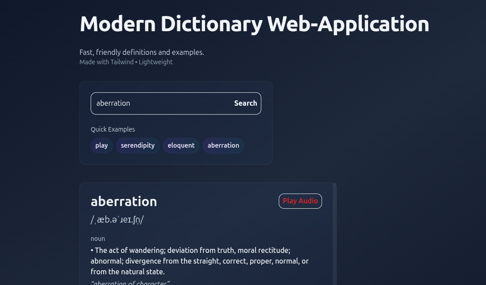

# Dictionary Web-Application

A clean, responsive dictionary web application built with pure HTML, CSS, and JavaScript. Search any word and instantly get its definition, part of speech, phonetic pronunciation, and example sentences — powered by the Free Dictionary API.

---

## Table of Contents

- [Features](#features)
- [Screenshots](#screenshots)
- [Tech Stack](#tech-stack)
- [Project Structure](#project-structure)
- [How to Run](#how-to-run)
- [API Reference](#api-reference)
- [How It Works](#how-it-works)
  - [Fetching Data](#1-fetching-data)
  - [Rendering Results](#2-rendering-results)
  - [Error Handling](#3-error-handling)
- [Code Walkthrough](#code-walkthrough)
  - [HTML Structure](#html-structure)
  - [CSS Highlights](#css-highlights)
  - [JavaScript Logic](#javascript-logic)
- [Example API Response](#example-api-response)
- [Challenges and Learnings](#challenges-and-learnings)
- [Future Improvements](#future-improvements)
- [Requirements](#requirements)

---

## Features

- Search any English word instantly
- Displays word definitions grouped by part of speech (noun, verb, adjective etc.)
- Shows phonetic pronunciation text
- Plays audio pronunciation where available
- Shows example sentences for each definition
- Displays synonyms and antonyms
- Handles words not found with a friendly error message
- Fully responsive — works on mobile and desktop
- Clean, minimal UI with smooth transitions

---
## Screenshots


---

## Tech Stack

| Technology | Purpose |
|---|---|
| HTML5 | Page structure and semantic markup |
| CSS3 | Styling, layout, responsiveness |
| JavaScript (ES6+) | API calls, DOM manipulation, logic |
| Free Dictionary API | Word data source (free, no key needed) |

No frameworks. No libraries. No build tools. Just the fundamentals.

---

## Project Structure

```
dictionary-app/
│
├── index.html        → app structure and layout
├── style.css         → all styling and responsive design
├── app.js            → API calls, DOM rendering, error handling
└── README.md         → project documentation
```

---

## How to set-up


**Step 1 — Clone or download the project**

```bash
git clone https://github.com/Aucire/dictionary-app.git
```

**Step 2 — Open in browser**

```bash
cd dictionary-app
start index.html     
```

**Step 3 — Search a word**

Type any English word into the search bar and press **Enter** or click the search button.

---

## API Reference

This app uses the **Free Dictionary API** — completely free, no API key required.

**Base URL**
```
https://api.dictionaryapi.dev/api/v2/entries/en/{word}
```


**Response fields used in this app**

| Field | Description |
|---|---|
| `word` | The searched word |
| `phonetic` | Pronunciation text e.g `/ˈkloʊ.ʒər/` |
| `phonetics[].audio` | URL to audio pronunciation file |
| `meanings[].partOfSpeech` | noun, verb, adjective etc. |
| `meanings[].definitions[].definition` | The actual definition |
| `meanings[].definitions[].example` | Example sentence |
| `meanings[].synonyms` | List of synonyms |
| `meanings[].antonyms` | List of antonyms |

**Word not found response — HTTP 404**
```json
{
  "title": "No Definitions Found",
  "message": "Sorry pal, we couldn't find definitions for the word you were looking for.",
  "resolution": "You can try the search again at a later time or head to the web instead."
}
```

---

# How It Works

### 1. Fetching Data

When the user submits a word, a `fetch` call hits the Free Dictionary API:

```js
async function getDefinition(word) {
  const response = await fetch(
    `https://api.dictionaryapi.dev/api/v2/entries/en/${word}`
  );

  if (!response.ok) throw new Error("Word not found");

  const data = await response.json();
  return data;
}
```

The response is an array of objects — each containing meanings, phonetics, and definitions.

---

### 2. Rendering Results

The returned data is mapped over and injected into the DOM:

```js
function displayResults(data) {
  const word      = data[0].word;
  const phonetic  = data[0].phonetic;
  const meanings  = data[0].meanings;

  // render word, phonetic, then loop through meanings
}
```

Each `meaning` has a `partOfSpeech` and an array of `definitions` — the app renders them grouped by part of speech, just like a real dictionary.

---

### 3. Error Handling

Two types of errors are handled:

**Word not found (404)**
```js
if (!response.ok) {
  showError("Word not found. Please check your spelling and try again.");
  return;
}
```

**Network failure**
```js
try {
  const data = await getDefinition(word);
  displayResults(data);
} catch (error) {
  showError("Something went wrong. Check your internet connection.");
}
```

---

## Code Walkthrough

### HTML Structure

```html
<!-- Search Section -->
<div class="search-container">
  <input type="text" id="search-input" placeholder="Search a word..." />
  <button id="search-btn">Search</button>
</div>

<!-- Results Section -->
<div class="results-container">
  <div class="word-header">
    <h1 id="word"></h1>
    <span id="phonetic"></span>
    <button id="audio-btn">🔊</button>
  </div>

  <div id="meanings"></div>  <!-- definitions rendered here -->
</div>

<!-- Error Section -->
<div id="error-message" class="hidden"></div>
```

---

### CSS Highlights


**Responsive for mobile**
```css
@media (max-width: 480px) {
  .search-container {
    flex-direction: column;
  }

  input, button {
    width: 100%;
  }
}
```

---

### JavaScript Logic

**Search triggered on Enter key or button click**
```js
searchInput.addEventListener("keydown", (e) => {
  if (e.key === "Enter") handleSearch();
});

searchBtn.addEventListener("click", handleSearch);
```

**Playing audio pronunciation**
```js
function playAudio(audioUrl) {
  if (!audioUrl) return;
  const audio = new Audio(audioUrl);
  audio.play();
}
```

---

## Example API Response

```json
[
  {
    "word": "closure",
    "phonetic": "/ˈkloʊ.ʒər/",
    "phonetics": [
      { "audio": "https://api.dictionaryapi.dev/media/pronunciations/en/closure-us.mp3" }
    ],
    "meanings": [
      {
        "partOfSpeech": "noun",
        "definitions": [
          {
            "definition": "The act of closing or the state of being closed.",
            "example": "The closure of the factory affected hundreds of workers."
          }
        ],
        "synonyms": ["ending", "conclusion", "finish"],
        "antonyms": ["opening", "beginning"]
      }
    ]
  }
]
```

---

## Challenges and Learnings

**Inconsistent API data**
Not every word has a phonetic, audio, or example sentence. Every field had to be checked before rendering to avoid crashing the UI:
```js
const phonetic = data[0].phonetic ?? "Phonetic unavailable";
const audio    = data[0].phonetics.find(p => p.audio)?.audio || null;
```

**Async/Await error handling**
Learning to properly wrap `fetch` calls in `try/catch` and handle both network errors and bad HTTP responses (like 404) separately was a key challenge.

**DOM manipulation at scale**
Building the results section purely through JavaScript `innerHTML` and template literals — without a framework — reinforced how React's rendering model solves a real problem.

---

## Future Improvements

- [ ] Dark mode toggle
- [ ] Search history saved to `localStorage`
- [ ] Bookmark/save favourite words
- [ ] Support for multiple languages
- [ ] Skeleton loading animation while fetching
- [ ] Keyboard shortcut to focus the search bar (`/`)

---

## Requirements

- Any modern browser (Chrome, Firefox, Edge, Safari)
- Internet connection (for API calls)
- No installs, no dependencies